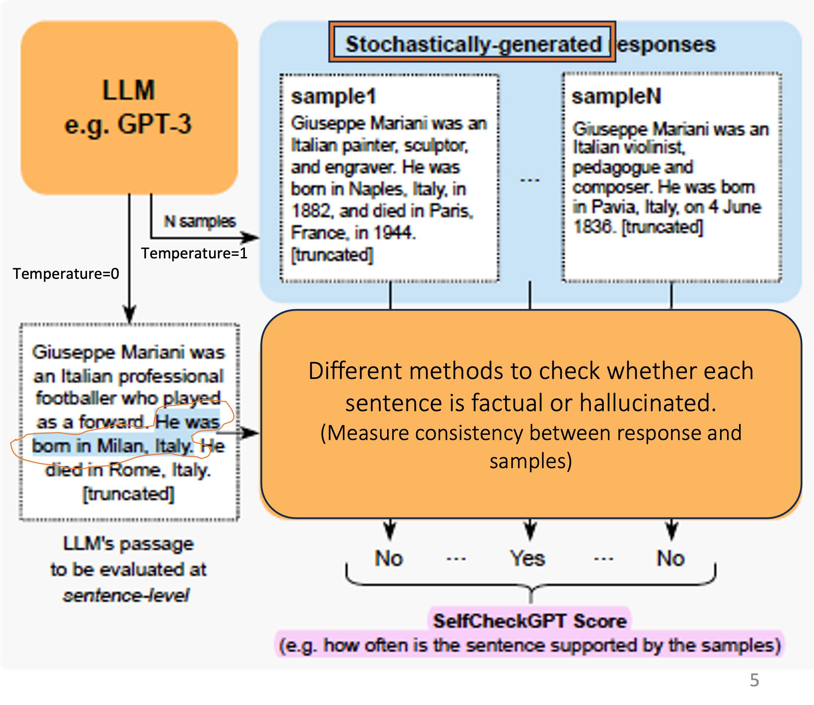

# **SELFCHECKGPT: Zero-Resource Black-Box Hallucination Detection for Generative Large Language Models**
**Authors: Potsawee Manakul, Adian Liusie, Mark J. F. Gales (University of Cambridge)**

## **Introducing SelfCheckGPT: Catching Mistakes Made by AI Language Models**
Large language models like GPT-3 are incredibly good at generating human-like text. 
However, sometimes they can make up facts or give incorrect information without realizing it. This is called "**hallucinating**."

In this blog, we'll explore SelfCheckGPT - a tool that can automatically detect when a language model is hallucinating or giving incorrect responses. 
It does this without needing any special access to the model's internal workings or external data sources.

We'll explain in simple terms how SelfCheckGPT works, the experiments we did to test it, and the results they got. Our goal is to help everyone understand the key ideas from the research paper in a clear and accessible way.
By the end, you'll know more about an important technique for making sure AI language models don't spread misinformation, even by accident. 

Stay tuned as we dive into the fascinating world of SelfCheckGPT! 🕵️‍♀️


## **Motivation**
1. **Hallucination Challenge:** Hallucinations are a significant issue for LLMs used in various applications, as they can generate false information.
2. **Zero-Resource Approach:** This method detects hallucinations without requiring extra data or model adjustments.
3. **Real-World Applicability:** It's designed to be efficient and integrate easily with existing LLMs.
<p align="right">
    
</p>

## **Research Objective**
The goal is to create a system that:
- Identifies factual vs. hallucinated information in LLM outputs.
- Evaluates factuality in a zero-resource, black-box manner.
- Detects hallucinations at both sentence and passage levels.

## **Black-Box Approach: SELFCHECKGPT**
The study "SELFCHECKGPT: Zero-Resource Black-Box Hallucination Detection for Generative Large Language Models" proposes a novel method called SelfCheckGPT, which analyzes the consistency between the generated response and multiple stochastically generated samples. The idea is that when an LLM knows a concept well, sampled responses will be consistent and factual. If a hallucination occurs, the samples will contain inconsistencies and contradictions.


### **Methodology**
SelfCheckGPT uses several statistical approaches for checking consistency:
<p align="right">
    
</p>

> # 1) BERTScore: A Simple Explanation
> 
> A metric designed to measure the similarity between sentences in a generated response and those found in sampled reference responses. It's particularly useful for evaluating the quality of generated text by comparing it to reference samples.
> 
> **How to Calculate BERTScore**
> 
> 1. **Calculate Pairwise Scores:**
> For each sentence in the generated response, compute the BERTScore between this sentence and every sentence in other sample responses.
> 
> 3. **Identify the Most Similar Sentence:**
> Find the sentence in the sample responses that has the highest BERTScore with the main sentence we want to assess. This sentence is the most similar to the given sentence.
> 
> 3. **Average the Maximum Scores:**
> For each sentence in the response, calculate the average of the maximum BERTScores obtained across all sentences. This average score is denoted as **S<sub>BERT</sub> (i)**.
> 
> **How to Interpret the Scores**
> 
> - Low S<sub>BERT</sub> (i):
> Indicates that the sentence i likely contains factual information, as it appears in multiple drawn samples.
> 
> - High S<sub>BERT</sub> (i):
> Suggests that the sentence i might be hallucinated or contain uncommon information, as it is found in fewer samples.
> 
> This way, we can gauge the similarity of each sentence in the generated response to the sampled responses, which helps identify how similar or distinct the generated sentences are.

---

> # 2) Question-Answering (QA): A Simple Explanation
>
> Evaluates consistency by generating multiple-choice questions based on the generated response and assessing how many questions have consistent answers across samples.
>
> **Main Response:** "Albert Einstein was born in 1879 in Germany. He is known for his theory of relativity and won the Nobel Prize in Physics in 1921."
>
> **Generated Questions:**
>
> 1. **Q1:** When was Albert Einstein born?
> 
>   - [x] 1879 
>   - [ ] 1885 
>   - [ ] 1890 
>   - [ ] 1900
>
> 3. **Q2:** Where was Albert Einstein born?
>   
>   - [ ] Iran 
>   - [ ] US 
>   - [x] Germany 
>   - [ ] Italy
>
> 3. **Q3:** For what is Albert Einstein known?
>   - [x] Theory of relativity 
>   - [ ] Quantum mechanics 
>   - [ ] Evolution theory 
>   - [ ] Thermodynamics
>
> **Independent Answering System:**
>
> - Uses other sampled responses as context.
> - Attempts to answer generated questions based on sample responses.
> - Measures consistency by comparing the system's answers to the correct answers based on the main response.

---

> # 3) n-gram: A Simple Explanation
>
> Uses n-gram models trained on sampled responses to estimate the likelihood of each token in the generated response.
>
> **Main Response:** "The Eiffel Tower is located in Berlin and is made of chocolate."
>
> **Sampled Responses:**
>
> - The Eiffel Tower is in Paris and made of iron.
> - The Eiffel Tower is a famous landmark in France.
> - The Eiffel Tower was constructed in 1889.
>
> **Method:**
>
> - Train an n-gram model on the sampled responses.
> - Assess the main response sentence by sentence using the n-gram model.
>
> **Assessment:**
>
> - "The Eiffel Tower is located in Berlin": Low probability, as the sampled responses indicate that the Eiffel Tower is in Paris.
> - "and is made of chocolate": Low probability, as the sampled responses indicate that the Eiffel Tower is made of iron.
>
> **How to Interpret the Scores**
>
> - High negative log probabilities suggest potential hallucinations.
> - Sentences that contradict the sampled responses are flagged.

---

> # 4) Natural Language Inference (NLI): A Simple Explanation
>  
> Determines whether sampled responses contradict the generated response using Natural Language Inference models.
> 
> **Method:**
> 
> - Input: Concatenation of a sampled response (premise) and the assessed sentence of the Main Response (hypothesis).
> - Contradiction Probability: Calculated using logits for 'entailment' and 'contradiction' classes.
> 
> **SelfCheckGPT with NLI Score:**
> 
> - Calculate the average of contradiction probabilities across all sampled passages.
> - Higher score indicates a higher likelihood of hallucination.


---

> # 5) Prompting: A Simple Explanation
>
> Queries the LLM to assess whether a given sentence in the response is supported by the sampled responses through Yes/No questions.
>
> **Prompt Template:**
>
> ```
> Sentence: {}
> Context: {}
> Is the sentence supported by the context above?
> Answer Yes or No:
> ```


## **Demo Code for SelfCheckGPT Paper**

To demonstrate SelfCheckGPT, here's a simplified overview of the process:

```python
import torch
import spacy
from datasets import load_dataset

dataset = load_dataset("potsawee/wiki_bio_gpt3_hallucination")
nlp = spacy.load("en_core_web_sm")
device = torch.device("cuda" if torch.cuda.is_available() else "cpu")

# Example passage and responses
passage = "The Eiffel Tower is a symbol of French culture and ingenuity. It stands tall in the heart of Chantilly. Also it constructed primarily from wrought iron."
sample1 = "The Eiffel Tower, recognized globally, dominates the Parisian skyline, crafted from over 7,000 metric tons of iron."
sample2 = "The Eiffel Tower, an iconic structure, stands as a testament to France's architectural advancement, erroneously believed to be solely designed by Gustave Eiffel."
sample3 = "Inaugurated in 1889 for the World's Fair, the Eiffel Tower's creation marked a pivotal moment in engineering history, despite Gustave Eiffel's initial reservations."

from selfcheckgpt.modeling_selfcheck import SelfCheckMQAG, SelfCheckBERTScore, SelfCheckNgram, SelfCheckNLI, SelfCheckLLMPrompt

selfcheck_mqag = SelfCheckMQAG(device=device)
selfcheck_bertscore = SelfCheckBERTScore(rescale_with_baseline=True)
selfcheck_ngram = SelfCheckNgram(n=1)
selfcheck_nli = SelfCheckNLI(device=device)

llm_model = "mistralai/Mistral-7B-Instruct-v0.2"
selfcheck_prompt = SelfCheckLLMPrompt(llm_model, device)

sentences = [sent.text.strip() for sent in nlp(passage).sents]
samples = [sample1, sample2, sample3]

# Use SelfCheckGPT models for evaluation
mqag_scores = selfcheck_mqag.predict(sentences, passage, samples[:3], num_questions_per_sent=2)
bertscore_scores = selfcheck_bertscore.predict(sentences, samples[:3])
ngram_scores = selfcheck_ngram.predict(sentences, passage, samples[:3])
nli_scores = selfcheck_nli.predict(sentences, samples[:3])
prompt_scores = selfcheck_prompt.predict(sentences, samples[:3], verbose=True)

print(mqag_scores)
print(bertscore_scores)
print(ngram_scores)
print(nli_scores)
print(prompt_scores)
```


## **Experiments and Results**

### **Dataset**
The WikiBio dataset was used, focusing on the longest rows to generate synthetic Wikipedia articles using GPT-3.

### **Experiments Observation**

- **MQAG:** Effective at detecting factual inaccuracies by asking questions across multiple responses.
- **BERTScore:** Effective at evaluating factual sentences but struggles if the sentence isn't in the sampled responses.
- **n-gram:** Useful for analyzing the likelihood of factual information based on word usage.
- **NLI:** Identifies contradictions in the text even without explicit facts.
- **Prompt:** Assesses factuality effectively by directly querying an LLM, but results depend on the model's knowledge.

## Results

The table below summarizes the results of the 5 variants of scores used in the SelfCheckGPT method for hallucination detection.


The experiments show that SelfCheckGPT is really good at detecting when a language model generates incorrect or made-up information (hallucinations). The best version of SelfCheckGPT, called the "Prompt" variant, performed much better than other methods that use GPT-3's own probabilities or more complex approaches.

Even the other versions of SelfCheckGPT, like BERTScore, QA, and n-gram, did better than these other methods in most cases. Interestingly, a very simple version called "unigram (max)" that just looks for uncommon words in the generated text, worked surprisingly well across different setups. This suggests that if a word appears rarely in the generated samples, it's likely not factual.

The version using Natural Language Inference (NLI) also performed really well, almost as good as the Prompt version. But since Prompt requires more computation, NLI could be the most practical choice, giving good performance without being too computationally expensive.

Overall, the results show that SelfCheckGPT's approach of just using the language model's own generated samples, without needing any extra data or access to the model, is really effective for identifying factual versus made-up information.


## **Conclusion**
SelfCheckGPT is a highly effective, zero-resource hallucination detection method for Large Language Models, suitable for various applications without requiring internal model data or external databases. However, its performance can vary based on the method used, with each method having its own strengths and weaknesses as outlined in the experiments.


---

*Code and dataset can be found on the [project page](https://github.com/potsawee/selfcheckgpt).*
